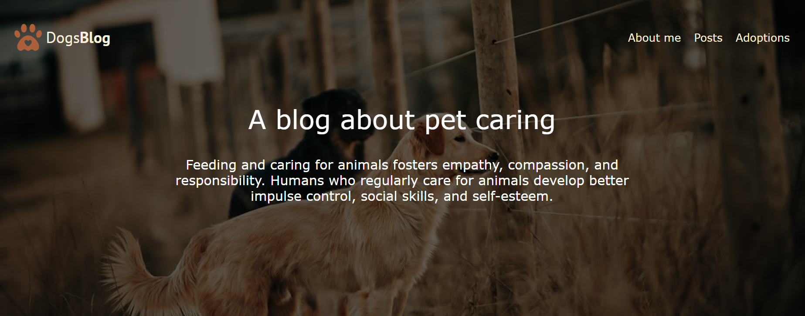
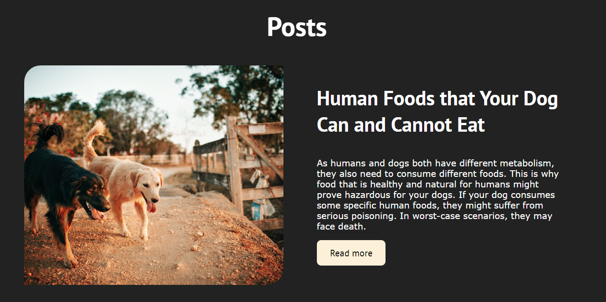
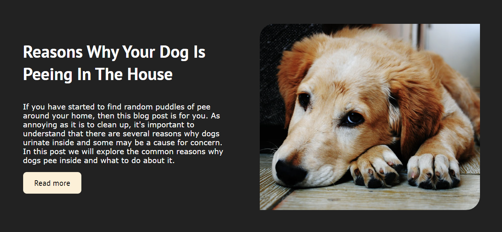
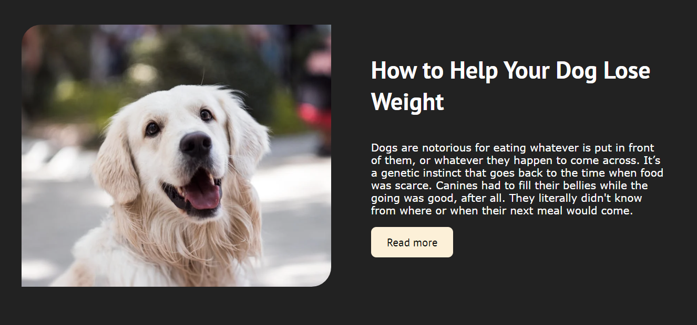

# Dogs Blog



## Table of Contents

- [Overview](#overview)
- [Features](#features)
- [Installation](#installation)
- [Usage](#usage)
- [Technologies](#technologies)
- [Screenshots](#screenshots)
- [Contributing](#contributing)
- [Contact](#contact)

## Overview

**DogsBlog** is a professional and comprehensive blog dedicated to pet care, focusing on dogs. Our goal is to foster empathy, compassion, and responsibility by providing valuable insights and tips on feeding and caring for dogs. Regular care for animals helps humans develop better impulse control, social skills, and self-esteem.

## Features

- **Informative Articles**: Regularly updated with articles on dog care, training, health, and more.
- **Adoption Resources**: Comprehensive guides and resources to assist with dog adoption.
- **Community Engagement**: Interactive features for commenting and sharing stories.
- **Responsive Design**: Optimized for viewing on all devices, from desktops to smartphones.

## Installation

To set up this project locally, follow these steps:

1. **Clone the Repository**:

    ```bash
    git clone https://github.com/singhkrishna01/Barking-Blog
    ```

2. **Navigate to the Project Directory**:

    ```bash
    cd Barking-Blog
    ```

3. **Open the Project**:

    Open `index.html` in your web browser to view the blog.

## Usage

- **Homepage**: Browse the latest articles on dog care.
- **Navigation**: Use the menu to explore:
  - **About Me**: Learn about the blog and its author.
  - **Posts**: Discover a variety of articles on dog care.
  - **Adoptions**: Access information and resources on adopting dogs.
- **Interaction**: Engage with the content by leaving comments and sharing posts on social media.

## Technologies

- **HTML5**: For the structure and content of the website.
- **CSS3**: For styling and layout.
- **JavaScript**: For interactive features and dynamic content.

## Screenshots

- **Human Foods that Your Dog Can and Cannot Eat :** 



- **Reasons Why Your Dog Is Peeing In The House :**



- **How to Help Your Dog Lose Weight :**




## Contributing

We welcome contributions to enhance the DogsBlog. To contribute:

1. Fork the repository.
2. Create a new branch (`git checkout -b feature-branch`).
3. Make your changes and commit them (`git commit -m 'Add new feature'`).
4. Push to the branch (`git push origin feature-branch`).
5. Open a pull request.

Ensure your code follows the existing style and includes relevant tests.


## Contact

Designed and developed by Krishna Singh. For any queries or collaboration, please reach out:

- **GitHub**: [singhkrishna01](https://github.com/singhkrishna01)
- **LinkedIn**: [krishnasingh20](https://www.linkedin.com/in/krishnasingh20/)
- **Email**: [krishna00cs@gmail.com](mailto:krishna00cs@gmail.com)

---
